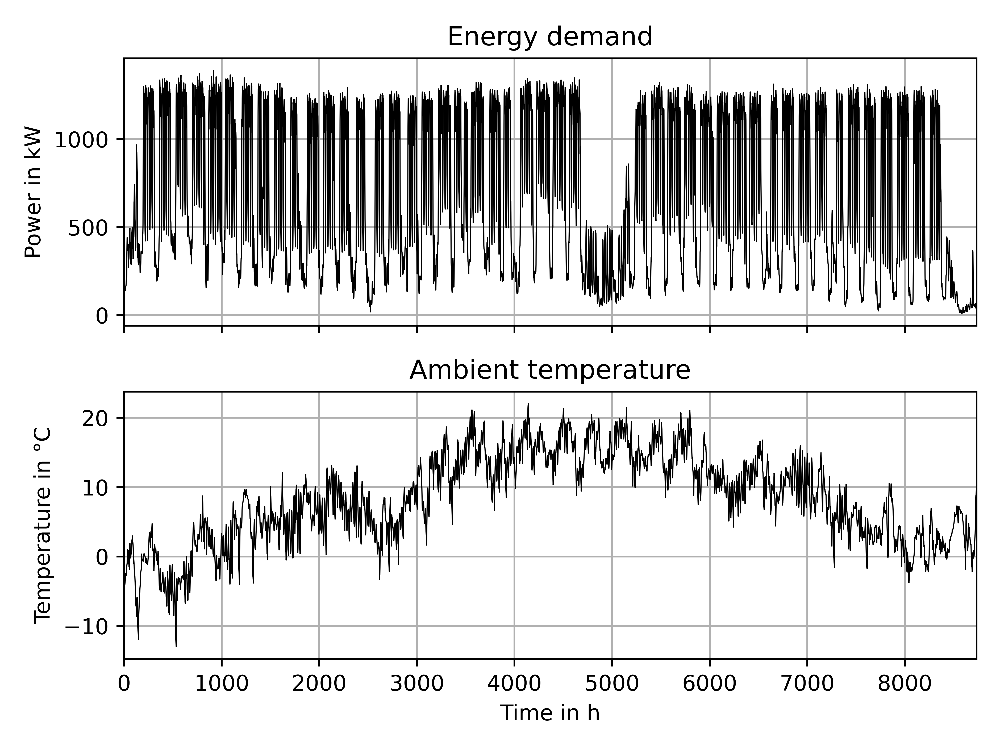

[](https://www.codacy.com/gh/dpiendl/typycal_periods/dashboard?utm_source=github.com&utm_medium=referral&utm_content=dpiendl/typycal_periods&utm_campaign=Badge_Coverage)

# typycal_periods

typycal_periods is a Python package for creating typical periods from large time series.
This is useful for running optimization algorithms on long time series to reduce the problem complexity without losing the characteristics of the original time series.

It is mainly based on the paper of Fazlollahi et al. (2014): *Multi-objectives, multi-period optimization of district energy systems: I. Selection of typical operating periods*.
[URL](https://www.sciencedirect.com/science/article/pii/S0098135414000751), [DOI](https://doi.org/10.1016/j.compchemeng.2014.03.005).

The workflow can be seen in the images below.
From an original time series with multiple attributes, energy demand and ambient temperature in this case,
three typical periods (red) are derived, which reflect the original time series to a certain degree.
The energy demand was weighted more than the ambient temperature,
thus resulting in a better representation of the energy demand.
The weights and number of typical periods can be chosen by the user.
Additionally, there performance measures and indicators are implemented, which evaluate the quality of the clustering,
enabling a reasoned choice of the number of typical periods.

|                    Original time series                     |                  Typical periods                  |
|:-----------------------------------------------------------:|:-------------------------------------------------:|
|  |  |

## Features
* Clustering of original time series data into representative typical operating periods,
* Normalization and weighting of the time series' attributes,
* Calculation of performance indicators to determine the minimum number of clusters,
* Calculation of measures to determine the optimal number of clusters,
* Plotting of the typical periods,
* Plotting of the trends of the performance measures and indicators over the number of typical periods and
* Documentation for all public interfaces and a test suite with full coverage to enable further development.

## Requirements
* Python 3.7 or higher,
* numpy >= 1.20,
* pytest >= 7.0.1,
* tslearn >= 0.5.2,
* scikit-learn >= 0.24.2,
* scipy >= 1.5.4 and
* matplotlib >= 3.3.4

## Installation
Activate your virtual environment or similar, then run:
```bash
pip3 install PATH\TO\DIRECTORY\OF\SETUP.PY
```

## Quick start
```python
import typycal_periods as tp

observations = tp.TimeSeriesObservations(raw_data)
# with raw_data as numpy array with shape (number of observations x length of an observation x number of attributes)

selector = tp.TypicalPeriodsSelection(observations, n_typical_periods_max=20)
selector.fit()
selector.evaluate()
typical_periods = selector.typical_periods(selector.n_opt)
```

## Example
There are examples in the folder /examples, showing how to use the performance measures and indicators to automatically
find the minimum and optimal number of typical periods, how to normalize and weight the input data and how to plot the results.

## License
Refer to the LICENSE file distributed with this package.
Cite the research paper that introduced the methodology this code is based on when creating your own software from this package.
